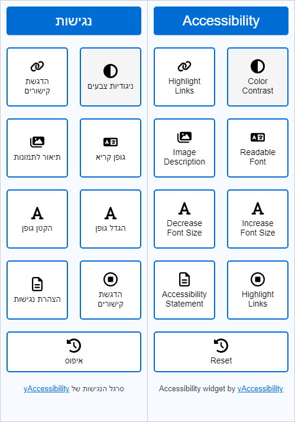

# yAccessibility - Free Accessibility Widget

**yAccessibility** is a free lightweight and easy-to-integrate accessibility widget for websites. It allows users to customize their browsing experience according to their needs, helping to make the site more accessible for people with disabilities. Important to note that adding an acessibility widget to your site doesn't make your site fully accessible. 



## Key Features

*   **Color Contrast:** Change color contrast for improved readability.
*   **Grayscale:** Convert the website to grayscale for users with specific visual needs.
*   **Highlight Links:** Highlight links to make navigation easier.
*   **Readable Font:** Switch to a more readable font.
*   **Image Description:** Display image descriptions (alt text).
*   **Increase/Decrease Font Size:** Control text size.
*   **Stop Animations:** Stop flickering animations that may be distracting.
*   **Big Cursor:** Change the cursor to a larger size for better visibility.
*   **Multi-Language Support:** The widget supports multiple languages, and you can contribute new translations!
*   **Easy Integration:** The widget can be easily integrated into any website.
*   **Open Source:** The widget's code is available to everyone, allowing for modifications and contributions.
*   **Reset:** Button that allows to reset all changes.
*   **Statement page:** Button that opens the statement page on your site.

## Installation and Usage 

If you want to use a CDN, skip steps 1-2. 

1.  **Download Files:** Download the `yaccessibility.js`, `yaccessibility.css` files, and `languages` folder from the repository.
2.  **Add to Website:** Add the files to any folder in your website server.
3.  **Add JavaScript Link:** Before closing the `</body>` tag of your HTML file, add the following lines:

    ```html
    <script src="yaccessibility.js"></script>
    ```

    Or the CDN link:

    ```html
    <script src="https://cdn.jsdelivr.net/gh/yortem/yAccessibility@latest/yaccessibility.js"></script>
    ```

4. **Call the function:**

    By adding these lines or similar lines according to the explaination at the bottom of this page.

    ```html
    <script>
        yAccessibility({
            language: 'he', // Set the language to Hebrew
            statement: 'accessibility-statement.html' // Optional: The URL to the accessibility statement file
        });
    </script>
    ```

    *   **Explanation:**
        *   The `yAccessibility` function takes an **options object** as a parameter.
        *   **`language`:** (Optional, default: `'en'`) Specifies the desired language code (e.g., `'en'`, `'he'`). If there is no translation for the specified language, the English language will be displayed as the default.
        *   **`statement`:** (Optional, default: `null`) Specifies the URL to your accessibility statement page. If provided, a button linking to this page will be added to the widget.
        *   **`verticalPosition`:** (Optional, default: `'bottom'`) Specifies the vertical position of the accessibility button. It can be either `'top'` or `'bottom'`.
        *   **`verticalOffset`:** (Optional, default: `20`) Specifies the vertical offset in pixels from the top or bottom edge of the screen, depending on the `verticalPosition` setting.


    **Example of using default values:**
    ```html
        <script>
            yAccessibility(); // use default english langauge without statement page and at the bottom left
        </script>
    ```
    **Example of using Hebrew language with statement page and at the top left with 40 pixels from the top:**
    ```html
        <script>
            yAccessibility({
                language: 'he', 
                statement: 'accessibility-statement.html',
                verticalPosition: 'top',
                verticalOffset: 40 
            });
        </script>
    ```

## Multi-Language Support

The widget supports multiple languages using JSON files. Each language is in a separate file within the `languages` directory. feel free to add your language if it doesn't exists in the repositery. 

### Language File Structure

Each JSON file contains key-value pairs. The key is a unique identifier, and the value is the translated text in the relevant language.

**Example (`en.json`):**

```json
{
    "accessibility_title": "Accessibility",
    "open_accessibility_bar": "Open Accessibility Bar",
    "close_accessibility_bar": "Close Accessibility Bar",
    "contrast": "Color Contrast",
    "colorless": "Monochrome",
    "highlight_links": "Highlight Links",
    "simple_font": "Readable Font",
    "alt_text": "Image Description",
    "increase_font": "Increase Font Size",
    "decrease_font": "Decrease Font Size",
    "stop_flickering": "Stop Animations",
    "big_cursor": "Big Cursor",
    "accessibility_statement": "Accessibility Statement",
    "reset": "Reset",
    "credits": "Accessibility widget by "
  }
  ```